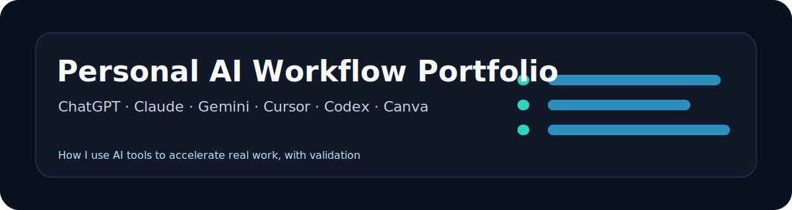

<p align="center">
  
</p>

<p align="center">
  
  
  
</p>

# Personal AI Workflow Portfolio

A portfolio of practical workflows showing how I use AI tools to support job search, research, data analysis, presentations, content creation, automation, and prototype development.

## At a Glance

| Item | Detail |
| --- | --- |
| Role fit | AI product, AI operations, data analytics with AI tooling |
| Core value | Makes AI tool experience concrete instead of vague |
| Main skills | Prompt workflows, task decomposition, validation loops, documentation |
| Recruiter signal | Can use AI responsibly to improve speed and output quality |

## Project Background

I regularly use ChatGPT, Claude, Gemini, Cursor, Codex, and Canva as part of my learning and project workflow. This repository explains how I use these tools responsibly: to structure thinking, speed up execution, compare approaches, and improve communication.

## Problem I Solved

Many candidates say they use AI tools, but few show a repeatable workflow. This project documents my actual AI-assisted working method in a format that recruiters and hiring managers can understand.

## Tools & Tech Stack

- ChatGPT, Claude, Gemini.
- Cursor and Codex for code assistance.
- Canva for visual communication.
- Python, Excel, SQL, Power BI depending on the task.
- Markdown and GitHub for documentation.

## Core Features

- AI workflow map.
- Prompt patterns for research, analysis, writing, and coding.
- Case studies for job search, data analysis, and prototype development.
- Human validation checklist.

## Project Highlights

- Shows AI as a productivity system rather than a vague buzzword.
- Emphasizes validation, iteration, and judgment.
- Connects AI tools with measurable job-search and project outcomes.

## Data / AI / Product Thinking

- Data thinking: AI helps form hypotheses and analysis plans; results are verified with data.
- AI thinking: prompts are treated as reusable workflows.
- Product thinking: each workflow starts from the user problem and ends with a deliverable.

## Outcome

This repository makes my AI tool experience concrete, transparent, and relevant to data analytics and AI product roles.

## Repository Structure

```text
personal-ai-workflow-portfolio/
├── README.md
├── case-studies/
│   ├── job-search-workflow.md
│   ├── data-analysis-workflow.md
│   └── prototype-workflow.md
├── prompt-workflow.md
├── screenshots/
└── assets/
```

## Resume Bullet

- Documented a personal AI workflow portfolio showing how ChatGPT, Claude, Gemini, Cursor, Codex, and Canva support research, data analysis, content creation, automation, and MVP prototyping.
